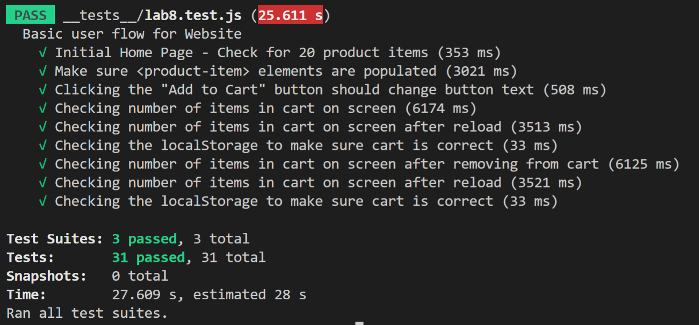

# Lab 8 - Starter
Frank Li

1. Within a Github action that runs whenever code is pushed. Because they should be automatic tests. Each time a part of the codes are finished, it should be tested. 
2. Yes. 
3. Yes. There may be a few parts of the process of massaging. We can test each part to see if it works properly using unit test. 
4. Yes. Max massage length is a single feature that can be tested individually. We can use unit test to see if this feature works as intended. 

